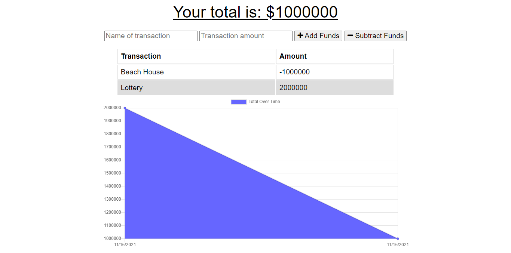

# PWA Budget Tracker
Bootcamp Homework #19

## Description 
I have refactored an app 
    
## Table of Contents

- [Installation](#installation)
- [Usage](#usage)
- [License](#license)
- [Contributions](#contributions)
- [Link](#link) 
- [Technologies](#technologies)
- [Questions](#questions)

## Installation
This application requires Node therefore users should run "npm install" in their command line prior to use. 

## Usage

Here is a screen shot of the app:

## License
This project licensed under the [MIT License](https://opensource.org/licenses/MIT).

## Contributions
Please contact me at <ljhofer@gmail.com> to discuss contributions.

## Link
[Link to deployed on Heroku.](https://ljhofer-budget-tracker.herokuapp.com/)

[Link to project's GitHub repo.](https://ljhofer-budget-tracker.herokuapp.com/)

## Technologies
The program uses HTML, CSS, JavaScript, Node, Express, Mongoose, and Morgan.

## Questions
Please email any questions to <ljhofer@gmail.com> or reference my [GitHub profile](https://github.com/ljhofer). 